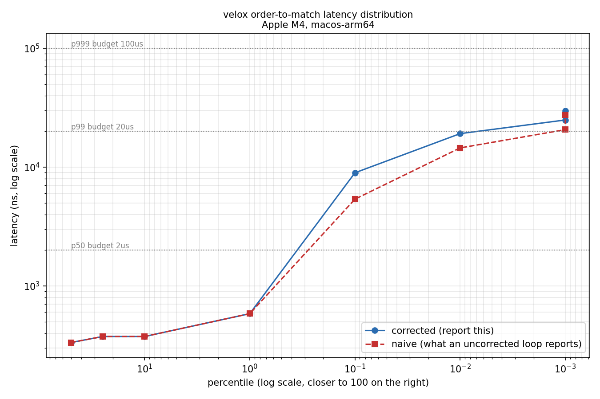

# velox — a low-latency order-matching engine

A single-threaded, deterministic, zero-allocation order-matching engine and mini-exchange in C++20.

**Status: Specs 001-004 complete (Phase A — Correct core, Phase B — Latency engineering).** The
engine handles the full order lifecycle (limit, market, IOC, FOK, cancel, cancel/replace,
self-trade prevention), matches by price-time priority, replays byte-identically, is proven
correct by a randomized invariant suite, and allocates **0 bytes per order** on the hot path. The
exchange surface (journal, gateway, market data, visualizer) is specified and queued — see
[`specs/`](specs/).

---

## What it is

The core of what a stock or crypto exchange runs. Buy and sell orders arrive; the engine maintains an
order book and matches them by **price-time priority** — best price first, then earliest arrival —
executing trades entirely in memory, optimized for the lowest and most *predictable* latency.

Around that core sits a thin but real exchange: a binary order gateway, a sequencer and journal that
make the system crash-recoverable and perfectly reproducible, a market-data feed, and a live
visualizer.

## The discipline

Two rules govern everything here, and they are enforced by tooling rather than by intention:

> **Every headline is a *measured* number on stated hardware — never "implemented X."**
> **Correctness is *proven* (replay + property + invariant tests), not claimed.**

The hot path (`engine/`, `book/`) may not allocate, lock, log, throw, or dispatch virtually. That is
checked by a git-committed hook on every file write and by a `latency-reviewer` sub-agent on every
edit. The performance budget is a build gate: a >20% p99 regression fails, exactly like a failing
test.

## Current measurements

Apple M4, macOS 26.5, Apple clang 21, `-O3 -DNDEBUG`, Release.
**No core isolation** — macOS provides none. See [`benchmarks/baselines/hardware.md`](benchmarks/baselines/hardware.md).

| | |
|---|---|
| Hot-path allocation | **0 bytes/op, 0 allocations/op** |
| Golden replay | **byte-identical** across 21 scenarios |
| Unit tests | 72 passing |
| Invariant (property) tests | 14 passing (randomized schedules, all profiles) |

Latency figures are in `benchmarks/baselines/summary.json`, and they come with caveats that travel
with them everywhere:

- They measure the **matching call in isolation** — no journal, no gateway, no ring buffer. This is
  not an end-to-end number and is not comparable to one.
- `steady_clock` on Apple Silicon has **~41 ns granularity**, which is *coarser than a single
  `submit()` call*. The harness therefore times batches of 64 and divides, and prints its own
  measured granularity so the limitation cannot quietly vanish from the output.
- The eventual ≥1M orders/sec throughput headline will be measured in `bench` mode, which **skips the
  journal** — making it a **no-durability number**. `fsync` costs tens of microseconds; a million per
  second is physically impossible on any storage device. That caveat is permanent and is stated
  everywhere the number appears.

## End-to-end latency (Spec 009)

The number above is the matching call in isolation. This is the **real order-to-match figure**,
driven through the actual ring → matching thread → outbound path by a rate-driven load generator
(`velox_loadgen`) against an intended schedule, with `hdr_record_corrected_value()` correcting for
coordinated omission — see `.claude/skills/benchmark-methodology/SKILL.md` for why that correction
is mandatory, and `tests/bench/co_correction_test.cpp` for the test that proves it is actually on.



Three paths, never blended (constitution Principle 6 — never let one flattering path stand in for
all three):

| path | what's measured | durable? | TCP? | p50 | p99 | gated? |
|---|---|---|---|---|---|---|
| `engine` | ring → matching thread → outbound ring | no | no | ~0.3 µs | ~34 µs | **yes**, vs baseline |
| `durable` | as `engine`, plus Sequencer + JournalWriter fsync | **yes** (`F_FULLFSYNC`) | no | ~3.6 ms | ~8.3 ms | no — fsync-bound |
| `wire` | real `GatewayServer`, real wire protocol, loopback TCP | yes | **yes** | ~4.0 ms | ~28.9 ms | no — TCP+fsync-bound |

These `durable`/`wire` figures are illustrative smoke-test numbers from this dev machine, not a
promoted baseline — only `/perf-baseline` promotes a number into the regression gate. The `engine`
path is the only one whose p99 can live inside the ≤20 µs budget; `durable` and `wire` are
fsync-per-record dominated by construction (`FsyncPolicy::PerRecord` — see
`sequencer/journal_writer.hpp`), and reporting a fast number for either would misrepresent what a
durable or wire-connected client actually experiences. Run `./build/benchmark/velox_loadgen
--path=<path> --rate=<N> --samples=<N>` to reproduce; `/bench` runs and gates the `engine` scenario.

## Live visualizer (Spec 010)

A strictly read-only web app (`velox_viz`) renders the order book and the latency histogram live,
fed over WebSocket from the market-data + latency streams. It is a pure downstream consumer — it
never writes a byte toward the engine (verified at the socket level,
`tests/viz/readonly_test.cpp`), and its decoupling from the matching hot path is *measured*, not
asserted, by `scripts/viz_decoupling.sh`.

```bash
./build/benchmark/velox_loadgen --path=engine --rate=200000 --samples=20000000 \
    --md-port=9001 --stats-port=9002 &
./build/apps/velox_viz --port=8080 --md=127.0.0.1:9001 --stats=127.0.0.1:9002
# open http://localhost:8080 — ladder animates, histogram updates ≥1×/sec
```

It also runs from a **replayed journal** (`velox_loadgen --replay-journal=DIR --start-on-subscriber
--loop`), producing a byte-identical demo every time — `tests/viz/replay_determinism_test.cpp`
spawns the real binary twice and diffs the captured market-data stream. See
`specs/010-live-visualizer/plan.md` for the design and the real bug this determinism test caught.

## Multi-instrument sharding (Spec 011)

CON-2 settles how this scales: the matching hot path is never threaded. Instead, scaling is
**horizontal, by instrument** — N instruments, N fully independent single-threaded engines, N
cores, nothing shared. Each shard (`runtime::Shard`) is the *entire* vertical slice from Specs
001–008 — its own ring, matching thread, journal, snapshot thread, sequencer — so every guarantee
the single-instrument engine had (determinism, isolation, recoverability) holds per shard, because
each shard *is* that engine.

```bash
./build/apps/velox_gateway --journal=DIR --creds=FILE --port=9001 \
    --instruments=1,2,3 --md-port=9002
./build/apps/velox_viz --port=8080 --md=127.0.0.1:9002 --instrument=2   # one book at a time
./scripts/shard_scaling.sh          # sweeps --shards=N, writes benchmarks/shard_scaling.csv
```

`tests/shard/isolation_test.cpp` proves the isolation mechanically: a shard jammed until its
matching thread is spinning on a full outbound ring (`fullSpins() > 0`) never slows its neighbour's
`processedCount()` or touches its book. `tests/shard/determinism_test.cpp` replays an existing
golden scenario on one shard while a *different* scenario runs concurrently on another, and still
gets a byte-identical match against the single-shard golden file.

**Honest limits, stated rather than hidden (per the spec):**
- **No cross-instrument atomicity.** There is no way to atomically trade one instrument against
  another — no basket orders, no cross-instrument risk checks. A real exchange that needs that
  uses a different architecture.
- **Scaling is bounded by physical cores.** Past that you are time-slicing, and the tail latency
  threading was avoided to protect comes back anyway. `velox_loadgen --shards=N` needs 3 threads
  per shard (paced sender + pinned matching + reader) and prints `OVERSUBSCRIBED` once
  `3N > hardware_concurrency`.
- **This dev box has no core isolation** (`platform::supportsCoreIsolation()` is false on
  macOS-arm64), so `scripts/shard_scaling.sh`'s curve is noisy here and only meaningful to
  roughly N=3 before OS scheduling dominates the measurement — see `progress_report.md` for the
  actual numbers measured on this hardware. The real curve belongs on the Linux benchmark target
  with core isolation.
- **Per-shard journal layout is a breaking change**: `<root>/journal` became
  `<root>/shard-<id>/journal`. A pre-Spec-011 single-instrument journal must be moved to
  `<root>/shard-1/` by hand — recovery from the old flat layout is deliberately not silently
  supported.

## Tier-3 Postgres audit tier (Spec 012)

The journal answers "did order X match" by replaying a binary file through a C++ program. It
does not answer "what did participant 7 do yesterday" in any form a human can query. `velox_auditd`
is a **separate, opt-in process** that tails a shard's journal off disk, replays it through a
shadow `OrderBook` (the same pattern `SnapshotThread` already uses for recovery), and writes
append-only rows into Postgres — a derived, queryable *projection* of the journal, never a second
source of truth.

The seam is the filesystem. `engine/`, `book/`, `ipc/`, `runtime/`, `gateway/`, and `marketdata/`
are untouched by this spec and do not link, include, or know about anything under `audit/` — kill
Postgres, kill `velox_auditd`, delete the database, and the matching engine does not observe any
of it, because there is nothing wired up to observe.

```bash
cmake -B build -G Ninja -DVELOX_BUILD_AUDIT_TIER=ON     # OFF by default; requires libpq
cmake --build build

psql -f audit/sql/001_init.sql <db>                      # velox_audit schema: 5 tables + 1 view
./build/apps/velox_auditd --journal=DIR --shards=1,2,3 --pg=<conninfo> \
                           [--batch=1000] [--poll-ms=50] [--from-scratch]

ctest --test-dir build -L audit                           # tailer + replayer determinism run with
                                                           # no database; the two ingest/isolation
                                                           # tests need VELOX_TEST_PG_CONNINFO set
                                                           # and GTEST_SKIP() cleanly without it
```

**Honest limits, stated rather than hidden:**
- **Not durability, not a source of truth.** The journal remains the sole durability mechanism
  (constitution CON-8, amended — see `progress_report.md` [018]). The audit tier may lag
  arbitrarily behind the journal tail; it never blocks, throttles, or is waited on by anything on
  the order-entry path.
- **No cross-instrument ordering.** Each shard's rows are consistent within that shard
  (`global_seq` order); there is no total order across shards, matching the sharding model's own
  stated limit above.
- **No credentials, no risk limits, no telemetry tables.** `velox_audit` only has tables for what
  the engine actually emits — see `audit/sql/001_init.sql`'s header comment for the full list of
  what was deliberately left out and why.
- **`ingested_at`, never a trade time.** Nothing in `ipc::Command`/`Trade`/`OutboundEvent` carries
  a wall-clock timestamp — `global_seq` (ring-arrival order) is the only ordering key the schema
  has, by design (constitution P4, determinism).
- **Measured, not assumed, overhead**: `tests/audit/engine_isolation_test.cpp` runs the same
  order-entry workload with and without `velox_auditd` attached to the live journal and reports
  the real p99 delta — see `progress_report.md` [019] for the number measured on this hardware.
  It is not exactly zero (a second process reading the same files contends for page cache and
  disk I/O), and it is reported as such rather than rounded down to "no impact".

## Build and run

```bash
cmake -B build -G Ninja          # deps auto-fetched (GoogleTest, Google Benchmark, HdrHistogram_c)
cmake --build build

ctest --test-dir build -L unit          # 72 unit + structural tests
ctest --test-dir build -L replay        # golden replay, byte-for-byte (21 scenarios)
ctest --test-dir build -L invariant     # randomized property tests (14 profiles)
ctest --test-dir build -L alloc_check   # must report 0 bytes/op
ctest --test-dir build -L recovery      # journal/snapshot/sequencer + a real SIGKILL-and-recover
ctest --test-dir build -L viz           # visualizer: handshake, ladder, zero-bytes, replay determinism
ctest --test-dir build -L shard         # per-shard determinism + isolation (Spec 011)
ctest --test-dir build -L audit         # Tier-3 audit tier (Spec 012, opt-in build, see above)
./build/benchmark/velox_bench           # p50/p99/p999
./build/benchmark/velox_alloc_check     # must report 0 bytes/op
```

Requires CMake ≥ 3.24, Ninja, and a C++20 compiler. Nothing else — no vcpkg, no Conan. The audit
tier is the one opt-in exception: `-DVELOX_BUILD_AUDIT_TIER=ON` additionally requires libpq.

## Recovery (Spec 006)

`apps/velox_live` is a real process with a durable journal in front of the matching engine, so a
crash mid-stream is recoverable rather than fatal:

```bash
./build/apps/velox_live --mode=live    --journal=DIR [--snapshot-every=N] [--group-commit=N]
./build/apps/velox_live --mode=recover --journal=DIR [--digest-out=FILE]
./build/apps/velox_live --mode=bench   --journal=DIR   # journal OFF -- no-durability headline path
```

Every inbound command gets a global sequence number, is fsynced to a segmented journal, and is
only THEN acknowledged (`ACK <seq>` on stdout) and handed to the matching thread. A background
shadow-replay thread owns its own independent `OrderBook` and periodically replays the journal
into a CRC32'd, atomically-renamed snapshot — the live matching thread's contribution to
snapshotting is zero: no flag, no copy-out, no pause, ever (determinism is what makes that sound).
Restart in `--mode=recover` and the engine rebuilds itself from the newest valid snapshot plus the
journal tail, with no manual step.

Two numbers that must never be conflated:

| Path | Measured (this repo, macOS-arm64, `F_FULLFSYNC`) | Guarantee |
|---|---|---|
| **Durable, `fsync` per record** (the default) | ~144 orders/sec | every ACKed order survives a crash |
| **Durable, `--group-commit=64`** | ~9,850 orders/sec | up to 63 unfsynced orders can be lost on power failure |
| **`--mode=bench` (no journal)** | 85,608,400 orders/sec | **none** — this is the matching-only headline, never durable |

`fsync` on macOS/APFS only flushes to the drive's write cache; the honest durable barrier is
`F_FULLFSYNC`, and it costs roughly two orders of magnitude more than that — which is exactly why
the per-record durable number above looks small. That is the true cost of the guarantee, not a bug.

## The order book

```
BidLevels (price DESC)              AskLevels (price ASC)
  direct-indexed array                direct-indexed array
  price -> PriceLevel*                price -> PriceLevel*
  + bestBid tracked as a field        + bestAsk tracked as a field

     each PriceLevel = intrusive doubly-linked FIFO of Orders
     head ──> [Order] <──> [Order] <──> [Order] <── tail
             (earliest)                 (latest)

OrderIdMap: open-addressed id -> Order*   ← makes cancel O(1)
```

| Operation | Cost |
|---|---|
| Best bid / ask | O(1) — a tracked field |
| Insert | O(1) |
| **Cancel** | **O(1)** — id map finds it, intrusive links unlink it |
| Match | O(fills) |

**Why not a heap?** O(log n) best-price, but **O(n) cancel** — you cannot locate an arbitrary order.
Real order flow is dominated by cancels (often >90% of messages), so a heap optimizes the rare case at
the expense of the common one.

**Why not `std::map`?** A cache-hostile red-black tree with a node allocation per price level.

Prices are **scaled `int64_t`** (× 10,000). There is no floating point in the engine: floats bring
rounding error into money and non-determinism into comparison.

## Development

Spec-driven. The [`specs/`](specs/) backlog is a committed artifact — 001 through 011, each with
scope, a Definition of Done, and the requirements it satisfies. `plan.md` and `tasks.md` are written
when a spec is *picked up*, not in advance, because planning against an imagined codebase produces
fiction.

[`progress_report.md`](progress_report.md) is the append-only story of how this was built — including
the bugs. Three real ones were caught building Spec 001 alone, two of them in the benchmark
methodology itself (a benchmark that was measuring its own instrumentation, and one that was measuring
the *rejection* path after silently exhausting the order pool). They are written up rather than
quietly fixed, because how a system was debugged is more informative than the fact that it now works.

The [`.claude/`](.claude/) directory ships the guardrails: 9 slash commands, 4 domain skills, 4
sub-agents, and hooks that auto-format and lint the hot path on every write. They are committed so
they travel with the repo.
